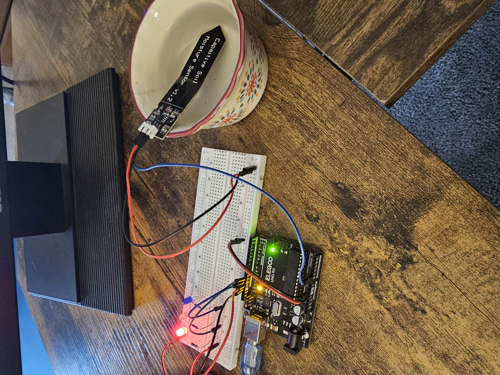

# Moisture Sensor State Machine (Bare-Metal AVR)

## Overview
This project is a **bare-metal AVR microcontroller exercise** focused on timing, ADC sampling, and deterministic state machines.  
It simulates a simple plant-watering controller using **LEDs as state indicators** and a **moisture sensor input**, without relying on Arduino high-level APIs.

The goal is **not** to ship a product, but to demonstrate low-level control, correct interrupt usage, and clean embedded architecture.

---

[]

---

## System Behavior
The system runs as a **3-state finite state machine**, advancing once per second:

- **IDLE** (Red LED)  
  System is waiting. Timer running, no ADC activity.

- **CHECK** (Green LED)  
  Moisture sensor is sampled via the ADC.

- **WATERING** (Blue LED)  
  Watering is simulated for one second (no real pump).  
  After this period, the system returns to IDLE.

### State Transitions
- IDLE → CHECK (every second)
- CHECK → WATERING if moisture is below threshold
- CHECK → IDLE if moisture is above threshold
- WATERING → IDLE (always, after one second)

---

## Timing Architecture
- **Timer0** is configured in **CTC mode** to generate a **1 kHz hardware tick**.
- A software divider derives a **1-second event** from the tick stream.
- All state transitions occur **only on the 1-second event**, ensuring deterministic timing and no drift.

Interrupts are used **only** to increment a tick counter.  
All logic runs in the main loop.

---

## ADC Usage
- The moisture sensor is connected to a single ADC channel.
- ADC reads are performed using a **blocking, datasheet-correct sequence**:
  - Start conversion
  - Wait for completion
  - Read result
- A configurable threshold determines whether watering occurs.

---

## LEDs as Debug Outputs
Each state is mapped to a single LED:
- Red   → IDLE
- Green → CHECK
- Blue  → WATERING

This makes system behavior observable without a debugger or serial output.

---

## What This Project Demonstrates
- Bare-metal timer configuration and math
- Interrupt-safe ISR ↔ main-loop communication
- Tick-based scheduling (no `delay()`)
- Correct ADC usage and timing
- Explicit finite state machine design
- Hardware-observable debugging via LEDs

---

## What This Project Intentionally Omits
- Fault/recovery states
- Power optimization
- EEPROM storage
- Real pump control
- Arduino HAL abstractions

These are deliberately excluded to keep the scope focused on **core embedded mechanics**.

---

## Build Notes
- Target MCU: ATmega328P
- Written in C/C++
- Uses direct register manipulation
- Compatible with PlatformIO or avr-gcc toolchains